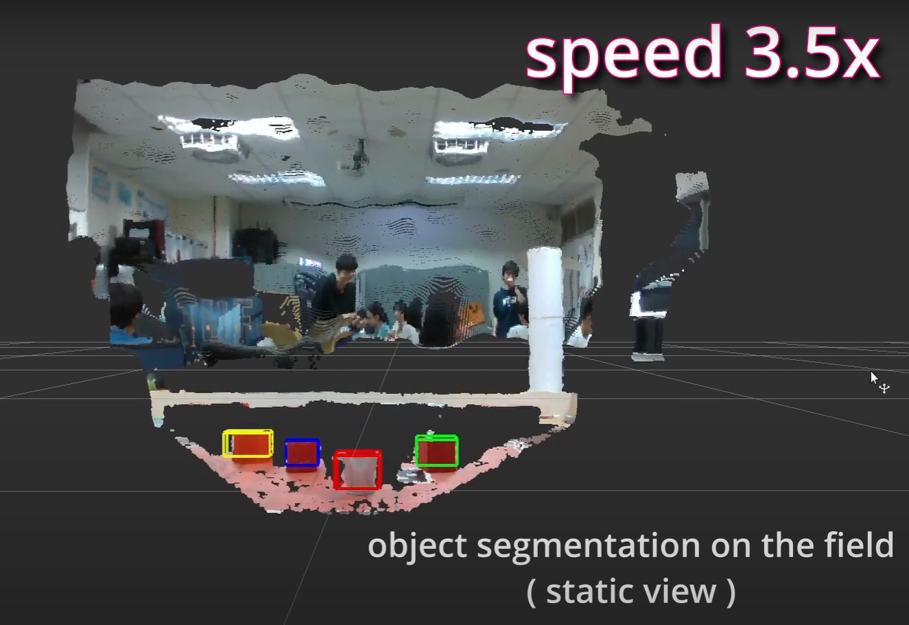
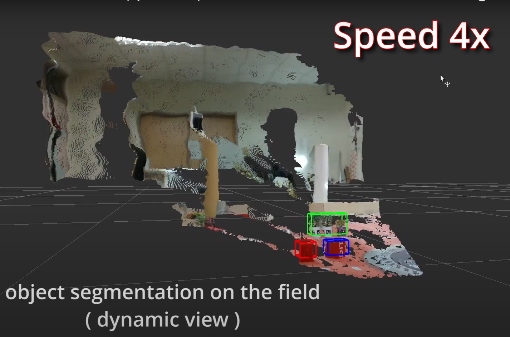

# Intel® RealSense™ Multifaceted Toolkit

This repository harness the RGBD Camera RealSense™ D435/D435i across a wide range of contexts and applications on ROS.

### Demonstration

|      Static View     |      Dynamic View      |
|:--------------------:|:----------------------:|
| [](https://youtu.be/AulwKrzP8cg?si=nGgHpC9bgyvMGtC9) | [](https://www.youtube.com/watch?v=scDBoZmQeG4) |


## A. Get Started

### Recommended Environment
* Ubuntu 18.04 or higher. 
* Docker must be installed.
* cam: Intel® RealSense™ D435 or D435i.

 
### Steps
1. Git clone this repo.

    ```bash
    git clone https://github.com/pomelo925/realsense-ros-env.git
    ```

2. Navigate to `/docker` and execute `docker.sh`.

    ```bash
    cd docker
    chmod +x docker.sh
    ./docker.sh
    ```

3. In Visual Studio Code, press `F1` to open the command palette.

4. Type and select Remote-Containers : "Attach to Running Container...".

5. Choose the container just started up.


## B. Codes
### English
The main script to start the entire process is `realsense-ros-env/ros-pcl-segmentation/startup/diff/diff-inspection.sh`. 

The core code for PCL Segmentation and DBScan Cluster is mainly located in `realsense-ros-env/ros-pcl-segmentation/extraction-ws/src/diff-rs-pcl2/src`.

This code was migrated from a private repo after the Eurobot 2024 competition. Please understand that due to the competition requirements, there are many special names and a rather complex startup and packaging method.

I will organize the code into a more general and user-friendly version if time permits, and I won't provide extensive comments on the folder structure and code before the revision.

Please let me know if you are interested and need any assistance.

### 繁中

這段程式碼是在 Eurobot 2024 比賽結束後，從私人 repo 移植過來的。
請見諒內部為比賽需求而有諸多特殊的命名，同時還有較難以理解的程式啟動方式和包裝。

未來若有時間我會整理好代碼，以改成更一般化和好上手的版本。在改版之前，我暫時不會為資料夾結構和代碼下過多註解。

請讓我知道如果你感興趣或需要任何協助 ~


## C. Checks and Errors
1. Make sure Intel® RealSense™ is detected by the host machine.
    Type `lsusb` in the terminal, and it should show something like:

    ```bash
    Bus 001 Device 004: ID 8086:0b3a Intel Corp. Intel(R) RealSense(TM) Depth Camera 435i
    ```

    >`dmesg | grep tty` will NOT list oout RealSense™ cuz it interfaces with specialized drivers UVC (USB Video Class) provided by the Intel RealSense SDK.

1. if error like this:
    ```bash
    07/12 05:04:42,078 ERROR [281472812437904] (librealsense-exception.h:52) xioctl(VIDIOC_G_CTRL) failed Last Error: Connection timed out
    ```
    Make sure Intel® RealSense™ is inserted on USB 3.0 port (with the blue mark).
